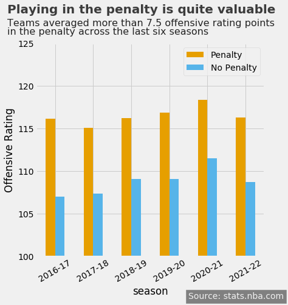
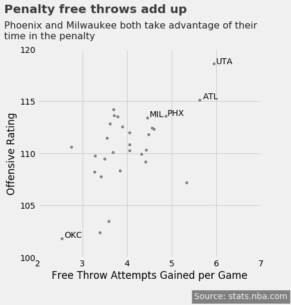
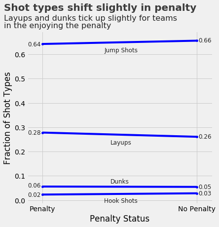

# team-fouls
Exploration and modeling of team foul accumulation in professional basketball

## Instructions

`team_fouls.py` ingests `--start_date`, `--end_date`, `--league`, and `--season` command line arguments to loop through NBA, WNBA, or G-League games played between those dates (inclusive). For each game, the script iterates over play-by-play data and extracts data related to team fouls accumulated by team and quarter, along with team performance in and out of the penalty. The output is a `.csv` file written to the local directory in the format `team_fouls_[start_date]_to_[end_date].csv`. Here's an example of how to run the script:

```
python team_fouls.py --start_date 2020-12-22 --end_date 2021-05-16 --league NBA --season 2020-21
```

The above would run through each game in the 2020-21 NBA regular season.

## Data

Team foul data by team and game is stored by season in the `data` folder. Here's a description of each column in each `.csv` file:

- `team_id`: Unique identifier of a team (PK)
- `game_length`: Length of the game in seconds
- `fouls_committed`: Total number of team fouls committed
- `fouls_3q_committed`: Total number of team fouls committed in the first three quarters
- `opp_tib`: Opponent's time in the bonus in seconds
- `opp_3q_tib`: Opponent's time in the bonus in the first three quarters in seconds
- `ft_allowed`: Opponent's FTA resulting from team fouls committed in the bonus. This excludes FTA resulting from shooting fouls in the bonus
- `ft_3q_allowed`: Opponent's FTA resulting from team fouls committed in the bonus in the first three quarters. This excludes FTA resulting from shooting fouls in the bonus
- `fouls_against`: Total number of team fouls comitted against a team
- `fouls_3q_against`: Total number of team fouls comitted against a team in the first three quarters
- `own_tib`: Team time in the bonus in seconds
- `own_3q_tib`: Team time in the bonus in seconds in the first three quarters
- `ft_gained`: FTA resulting from team fouls comitted in the bonus. This excludes FTA resulting from shooting fouls in the bonus
- `ft_3q_gained`: FTA resulting from team fouls comitted in the bonus in the first three quarters. This excludes FTA resulting from shooting fouls in the bonus
- `win`: 1 if the team won, 0 otherwise
- `opp_percent_tib`: Opponent's percentage of the game spent in the bonus
- `own_percent_tib`: Percentage of the game a team spends in the bonus
- `opp_percent_3q_tib`: Opponent's percentage of the game spent in the bonus in the first three quarters
- `own_percent_3q_tib`: Percentage of the game a team spends in the bonus in the first three quarters
- `game_id`: Unique identifier of the game
- `off_points_p`: Points scored in the penalty
- `off_poss_p`: Estimate of offensive possessions used in the penalty
- `off_tov_p`: Estimate of turnovers in the penalty
- `def_points_p`: Points allowed in the penalty
- `def_poss_p`: Estimate of defensive possessions used in the penalty
- `def_tov_p`: Estimate of turnovers caused in the penalty
- `off_points_np`: Points scored outside of the penalty
- `off_poss_np`: Estimate of offensive possessions used outside of the penalty
- `off_tov_np`: Estimate of turnovers outside of the penalty
- `def_points_np`: Points allowed outside of the penalty
- `def_poss_np`: Estimate of defensive possessions used outside of the penalty
- `def_tov_np`: Estimate of turnovers outside of the penalty

## Exploration



The difference in offensive rating inside and outside of the penalty is quite stark, with teams producing at an average rate of 7.5 more points per 100 possessions with opponents in the penalty across the seasons considered. Note the 2019-20 season only considers the games played prior to the pause due to the pandemic, while the 2021-22 season considers games played through January 5, 2022.



With the increase in offensive production with opponents in the penalty noted, how much are teams benefiting from free throw attempts gained through the penalty? These are free throws resulting from non-shooting fouls in the penalty, which would otherwise result in an inbound for the team being fouled.

As trips to the free throw line are associated with high expected points, these additional free throws correlate fairly well with team offensive rating. 



Offensive performance increases for teams enjoying the bonus and additional free throws gained correlates well with overall offensive rating. While the former point could be due to defenses playing less aggressively, offensive teams may change their approach to put more pressure on the defense.

Layups and dunks tick up for an offense when the opposition enters the penalty. Additionally, because missed shots that result in free throws are not included in this dataset, the changes in layups and dunks may be understated as those shots tend to result in free throws more often.
